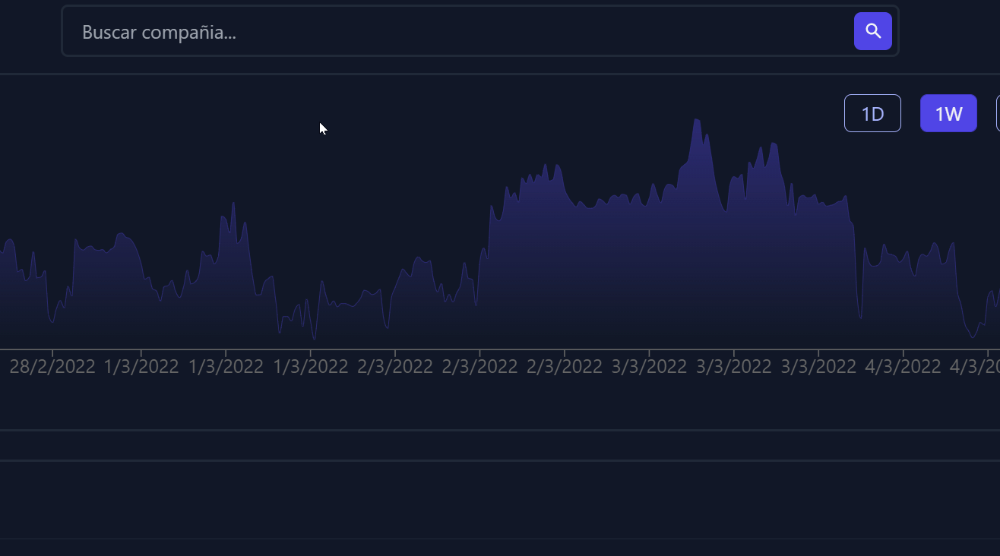
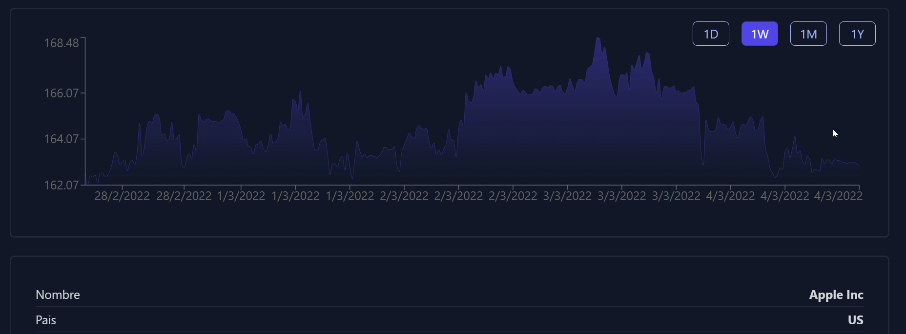
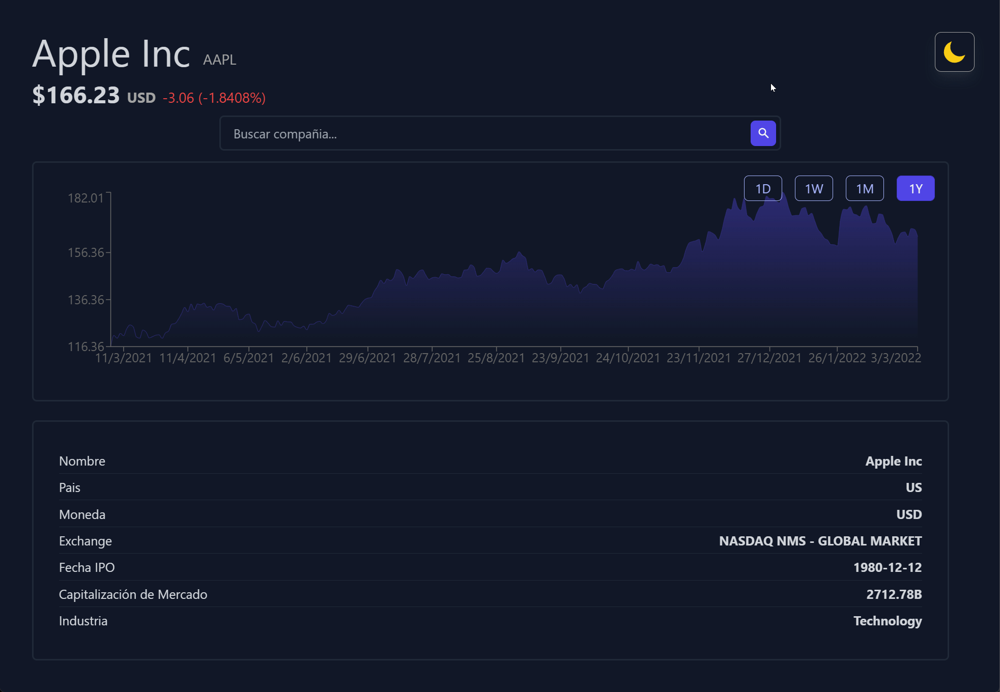

# Coin MarketcApp

Este proyecto consume la API de [Finnhub API](https://finnhub.io/)

 - Tiene un buscador para encontrar indices de empresas de la bolsa
-  Puedes ver información de la empresa y el precio en que cotiza en el momento de la busqueda
- Puedes filtrar para ver el historico entre dia, semana, mes, año
- Tiene un grafico
- Tiene DarkMode

## Examples

### Buscador

### Date Filter

### Select Theme

